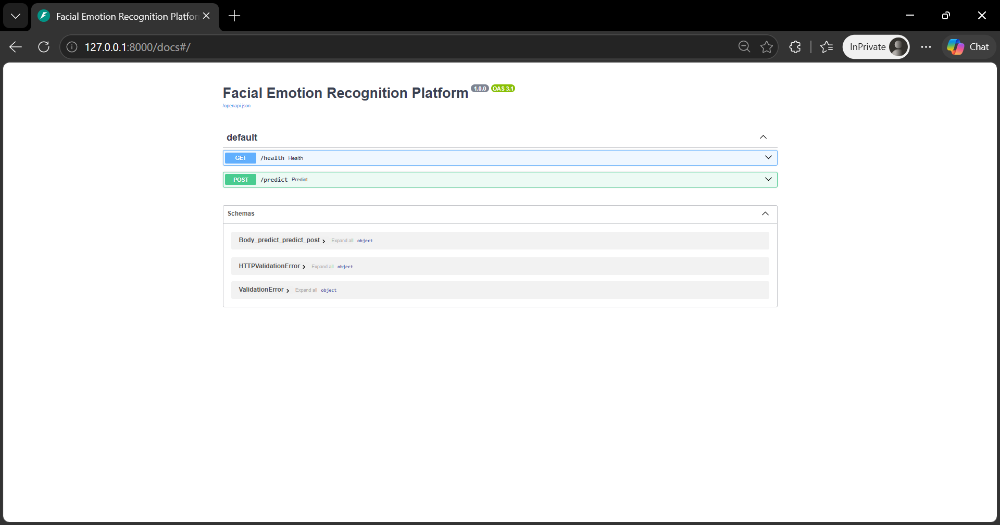
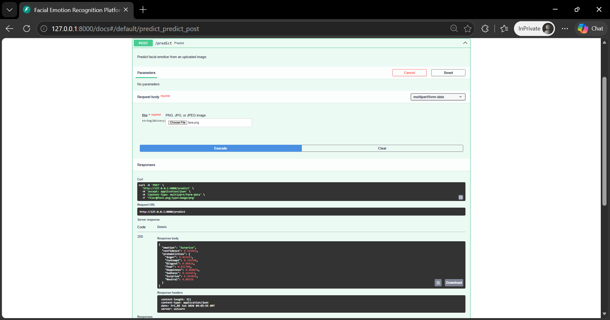

<div align="center">

# 🧠 Facial Emotion Recognition Platform

### Production-style computer vision project for facial-expression classification using Python, TensorFlow/Keras, OpenCV, and FastAPI


</div>

---

## 📌 Overview

This project is a production-style modernization of my original Bachelor’s computer vision project for facial-expression analysis. The original academic goal was to understand how a machine learning model can learn visual patterns from face images and classify expressions such as happiness, sadness, surprise, anger, fear, disgust, contempt, and neutral. That original intent is still preserved: the core of the project remains a convolutional neural network trained on a Cohn-Kanade-style facial-expression dataset.

It includes a clean training pipeline, reusable preprocessing utilities, FastAPI-based model inference, Docker support, automated tests, Ruff linting, CI workflow, model/report artifacts, and responsible AI documentation.

A key improvement in this version is API-ready preprocessing. Real uploaded photos often contain background, different lighting, and non-centered faces, while the training dataset is closer to cropped grayscale face images. The inference pipeline now performs extension validation, OpenCV-based face cropping, grayscale conversion, resizing, histogram equalization, normalization, and tensor shaping before sending the image to the Keras model.

---

## 🎯 Project Aim

The aim is to build a computer vision system that can:

<table>
<tr>
<td width="50%">

### 🧠 ML Objective
- Train a CNN on facial-expression data
- Classify emotion from face images
- Evaluate performance using model metrics
- Save reusable model artifacts

</td>
<td width="50%">

### ⚙️ Engineering Objective
- Expose predictions through an API
- Add Dockerized deployment support
- Add tests and CI checks
- Structure the project like a production ML service

</td>
</tr>
</table>

---

## ✨ Features

<table>
<tr>

<td width="33%" valign="top">

### 😊 Emotion Recognition

- CNN-based emotion classification
- 8 emotion categories
- Probability distribution output
- Real-time inference support
- Confidence scoring

</td>

<td width="33%" valign="top">

### 🖼️ Image Processing

- JPG/JPEG/PNG support
- Face detection
- Face cropping
- Grayscale conversion
- Histogram equalization
- Image normalization

</td>

<td width="33%" valign="top">

### 🚀 Engineering

- FastAPI REST API
- Docker support
- GitHub Actions CI
- Ruff linting
- Pytest test suite
- Training & evaluation pipeline

</td>

</tr>
</table>

---

## 🛠️ Tech Stack

<div align="center">

<table>
<tr>
<td align="center" width="25%">
<br/>
<b>Python</b><br/>
Core Language
</td>

<td align="center" width="25%">
<br/>
<b>TensorFlow / Keras</b><br/>
Deep Learning
</td>

<td align="center" width="25%">
<br/>
<b>OpenCV</b><br/>
Computer Vision
</td>

<td align="center" width="25%">
<br/>
<b>FastAPI</b><br/>
Inference API
</td>
</tr>

<tr>
<td align="center">
<br/>
<b>Docker</b><br/>
Containerization
</td>

<td align="center">
<br/>
<b>GitHub Actions</b><br/>
CI/CD
</td>

<td align="center">
<br/>
<b>Pytest</b><br/>
Testing
</td>

<td align="center">
<br/>
<b>Ruff</b><br/>
Code Quality
</td>
</tr>

<tr>
<td align="center">
<br/>
<b>NumPy</b><br/>
Numerical Computing
</td>

<td align="center">
<br/>
<b>Pandas</b><br/>
Data Processing
</td>

<td align="center">
<br/>
<b>Scikit-learn</b><br/>
Evaluation Metrics
</td>

<td align="center">
<br/>
<b>Uvicorn</b><br/>
API Runtime
</td>
</tr>
</table>

</div>

---

# 📸 Screenshots

<p align="center">
  
  
</p>

---

## 🧱 Architecture

```text
Image Upload
    │
    ▼
FastAPI /predict endpoint
    │
    ▼
Image validation
    │
    ▼
OpenCV preprocessing
    │
    ▼
TensorFlow/Keras CNN model
    │
    ▼
Emotion label + confidence score
```

---

<details>
<summary><strong>📁 Folder Structure</strong></summary>

```text
facial-emotion-recognition-platform/
│
├── app/                         # FastAPI inference service
│   ├── main.py                  # API endpoints
│   ├── inference.py             # Model loading and prediction logic
│   ├── preprocessing.py         # Image preprocessing utilities
│   └── config.py                # Runtime configuration
│
├── src/                         # Training and evaluation pipeline
│   ├── train.py                 # Training entry point
│   ├── model.py                 # CNN architecture
│   ├── dataset.py               # CSV dataset loading
│   ├── evaluate.py              # Metrics/report generation
│   └── capture_images.py        # Optional webcam capture utility
│
├── tests/                       # Automated tests
├── dataset/                     # Original dataset CSV
├── artifacts/models/            # Saved Keras model
├── reports/                     # Generated training/evaluation reports
├── legacy/scripts/              # Original Bachelor’s project scripts
├── docs/                        # Original academic report & screenshots/sample_images
├── .github/workflows/ci.yml     # GitHub Actions CI
├── Dockerfile
├── docker-compose.yml
├── requirements.txt
└── README.md
```

</details>

---

## 🚀 Local Setup

### 1. Clone the repository

```bash
git clone https://github.com/TaranjyotS/facial-emotion-recognition-platform.git
cd facial-emotion-recognition-platform
```

### 2. Create a virtual environment

```bash
python -m venv .venv
source .venv/bin/activate      # macOS/Linux
# .venv\Scripts\activate       # Windows
```

### 3. Install dependencies

```bash
pip install -r requirements.txt
```

### 4. Run the API

```bash
uvicorn app.main:app --reload
```

Open:

```text
http://127.0.0.1:8000/docs
```

---

## 🔮 API Usage

### Health check

```bash
curl http://127.0.0.1:8000/health
```

Expected response:

```json
{
  "status": "ok",
  "service": "Facial Emotion Recognition Platform"
}
```

### Predict emotion from image

```bash
curl -X POST "http://127.0.0.1:8000/predict" \
  -F "file=@sample-face.jpg"
```

Example response:

```json
{
  "emotion": "Happiness",
  "confidence": 0.912341,
  "probabilities": {
    "Anger": 0.0012,
    "Disgust": 0.0008,
    "Fear": 0.0101,
    "Happiness": 0.912341,
    "Sadness": 0.0204,
    "Surprise": 0.0498,
    "Neutral": 0.0053
  }
}
```

---

## 🧠 Train the Model

```bash
python -m src.train \
  --dataset dataset/cohn-kanade-dataset.csv \
  --model-output artifacts/models/emotion_detection_model.keras \
  --report-dir reports \
  --epochs 25 \
  --batch-size 32
```

Windows PowerShell alternative:

```powershell
python -m src.train --dataset dataset/cohn-kanade-dataset.csv --model-output artifacts/models/emotion_detection_model.keras --report-dir reports --epochs 25 --batch-size 32
```

> Note: If your terminal inserts characters like `[200~python`, paste the command as plain text or use the one-line PowerShell command above.

Training creates or updates:

```text
artifacts/models/emotion_detection_model.keras
reports/training_metrics.json
reports/training_accuracy.png
reports/classification_report.json
reports/confusion_matrix.json
```

---

## 🐳 Docker Usage

```bash
docker compose up --build
```

Then visit:

```text
http://localhost:8000/docs
```

---

## 🧪 Run Tests

```bash
pytest -q
```

Run linting:

```bash
ruff check app src tests
```

---

## 🧭 Modernization Summary

|  Original Academic Version   |         Upgraded Portfolio Version         |
|------------------------------|--------------------------------------------|
| Script-based prediction      | FastAPI inference service                  |
| Manual image path input      | Upload-based `/predict` API                |
| Basic CNN training script    | Reusable training pipeline                 |
| Limited structure            | Production-style folder layout             |
| Raw image resizing only      | Face-aware OpenCV preprocessing            |
| No tests                     | Pytest test suite                          |
| No deployment setup          | Docker and Docker Compose                  |
| No CI                        | GitHub Actions workflow                    |
| Basic README                 | Recruiter-friendly technical documentation |

---

## 🔮 Future Improvements

- Add frontend UI for image upload and prediction display
- Add Grad-CAM visual explanation for model predictions
- Add MLflow experiment tracking
- Add model versioning with DVC
- Add cloud deployment on AWS ECS or Render
- Add Prometheus/Grafana monitoring for inference latency and request volume
- Add more diverse training datasets and fairness evaluation

---

## 📄 License

This project is licensed under the [MIT License](LICENSE).

---

## 🎓 Academic Foundation

This project originates from work completed during the **Bachelor of Technology in Computer Science and Engineering** program at **Guru Gobind Singh Indraprastha University, Delhi, India**. It has been modernized into a production-style computer vision project while preserving the original goal of using deep learning for facial-expression analysis.

---

## ⚠️ Responsible AI & Privacy Disclaimer

This project is intended strictly for educational, research, and portfolio demonstration purposes.

The system performs facial-expression classification and does **not** identify individuals, store biometric identity profiles, or perform surveillance activities.

Any images used for training, evaluation, screenshots, or inference should be collected and processed with appropriate consent and in compliance with applicable privacy regulations.

Facial-expression recognition models can be affected by dataset quality, lighting, pose, camera quality, cultural context, and annotation subjectivity. Predictions should be treated as probabilistic model outputs, not guaranteed interpretations of a person’s internal emotional state.

This project should not be used for medical, legal, hiring, policing, education discipline, security screening, or other high-impact decision-making use cases.

---
